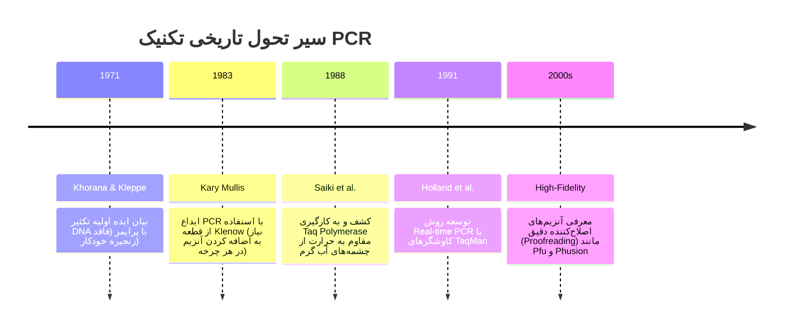

# تاریخچه، اصول و انواع روش‌های واکنش زنجیره‌ای پلیمراز (PCR)

این سند جامع به بررسی ریشه‌های تاریخی ابداع PCR، اصول مکانیکی و ترمودینامیکی آن و معرفی انواع روش‌های تخصصی و کاربردی PCR می‌پردازد.

---

<details>
<summary><b>۱. تاریخچه پیدایش PCR و نقش کلیدی کری مولیس (Kary Mullis)</b></summary>

ایده انقلابی **واکنش زنجیره‌ای پلیمراز (PCR)** در سال ۱۹۸۳ توسط **کری مولیس (Kary Mullis)**، در حالی که برای شرکت Cetus Corporation کار می‌کرد، مطرح شد. مولیس در یک شب‌نشینی و رانندگی در کالیفرنیا به ذهنش رسید که چگونه می‌توان یک قطعه مشخص از DNA را به‌صورت تصاعدی و در چرخه‌های متوالی تکثیر کرد. 

* **افتخارات:** به پاس این اختراع دگرگون‌کننده که زیست‌شناسی مولکولی را متحول کرد، کری مولیس در سال **۱۹۹۳ جایزه نوبل شیمی** را دریافت کرد.
* **تحول بزرگ بعدی:** در سال‌های اولیه، از آنزیم‌های DNA پلیمراز معمولی (مثل Klenow fragment) استفاده می‌شد که با هر بار افزایش دما برای واژگونی ساختار مارپیچ DNA (مرحله Denaturation در دمای $95^\circ\text{C}$)، ساختار پروتئینی آن‌ها از بین می‌رفت و باید در هر سیکل دستی آنزیم تازه اضافه می‌شد. در سال ۱۹۸۸، با کشف و استفاده از آنزیم مقاوم به حرارت **$Taq$ DNA Polymerase** (استخراج‌شده از باکتری *Thermus aquaticus* در چشمه‌های آب گرم یلوستون توسط توماس بروک)، کل فرایند خودکارسازی شد و دستگاه‌های ترموسایکلر متولد شدند.

# 01-History_principles.md: تاریخچه جامع، مبانی بیوشیمیایی و ترمودینامیک واکنش زنجیره‌ای پلی‌مرانی (PCR)

---

## ۱. مقدمه و تاریخچه تحولی PCR

تکنیک واکنش زنجیره‌ای پلی‌مرانی (Polymerase Chain Reaction - PCR) یکی از بنیادین‌ترین دستاوردهای زیست‌شناسی مولکولی مدرن است که در سال ۱۹۸۳ توسط **کاری مولیس (Kary Mullis)** در شرکت Cetus Corporation ابداع گردید و به پاس این کشف بزرگ، جایزه نوبل شیمی سال ۱۹۹۳ به وی اعطا شد.

### شکل ۱: خط زمانی تحولات تاریخی PCR


---

## ۲. اصول پایه و مکانیسم ترمودینامیکی PCR (Basic Principles)

اصول پایه PCR بر پایه سه مرحله حرارتی اصلی در هر سیکل استوار است که به‌طور مکرر (معمولاً ۳۰ تا ۴۰ بار) تکرار می‌شوند تا یک مولکول DNA به میلیاردها نسخه تبدیل شود:

1. **واشتدایی یا وادناسیون (Denaturation - دمای $94^\circ\text{C}$ تا $98^\circ\text{C}$):**
   شکستن پیوندهای هیدروجنی بین دو رشته DNA الگو و تبدیل ساختار دو‌رشته‌ای به تک‌‌رشته‌ای.

2. **اتصال پرایمر (Annealing - دمای $50^\circ\text{C}$ تا $65^\circ\text{C}$):**
   کاهش موقت دما تا پرایمرهای اختصاصی (Forward و Reverse) با توالی‌های مکمل خود در دو انتهای قطعه هدف روی رشته‌های تک‌رشته‌ای DNA پیوند برقرار کنند.

3. **تکثیر یا طویل‌سازی (Extension / Elongation - دمای $72^\circ\text{C}$):**
   بهینه‌ترین دمای فعالیت آنزیم $Taq$ پلیمراز. آنزیم از انتهای 3 پریم پرایمرها شروع به افزودن دئوکسی‌‌نوکلئوتیدها (dNTPs) کرده و رشته جدید را بر اساس الگو می‌‌سازد.

---

۱.۱. چالش آنزیم Klenow و جهش بزرگ با Taq
در نسخه‌های اولیه PCR از قطعه کلنو (Klenow fragment) آنزیم DNA Polymerase I باکتری E. coli استفاده می‌شد. این آنزیم در اثر دمای بالای مرحله دناتوراسیون ($94^\circ\text{C}-95^\circ\text{C}$) به سرعت واسرشت (Denature) و غیرفعال می‌گردید. در نتیجه، تکنسین مجبور بود در هر سیکل و پس از اتمام مرحله دناتوراسیون، درب تیوب را باز کرده و آنزیم تازه‌ای اضافه کند.
معرفی آنزیم ترمواکتیو و ترمواستابل Taq DNA Polymerase که از باکتری چشمه‌های آب گرم (Thermus aquaticus) جداسازی شده بود، پایداری آنزیم در دمای $95^\circ\text{C}$ را تضمین کرد.

۲. مکانیسم مولکولی و بیوشیمی واکنش تکثیر
واکنش PCR یک فرایند تکثیر آنزیمی in vitro است که الگوی DNA هدف را به صورت نمایی ($2^n$) تکثیر می‌کند.

شکل ۲: طرح‌واره اتصال پرایمرها و جهت بسط آنزیمی (5' -> 3')
```text
        5' |---------------------------------------------| 3'  (رشته الگوی اصلی)
                    <-- 3' [پرایمر رفت / Reverse] 5'
  
  3' |---------------------------------------------| 5'  (رشته الگوی اصلی)
        5' [پرایمر برگشت / Forward] 3' -->  
                                
  =======================> جهت سنتز آنزیم پلی‌مراز (از '5 به '3) =======================>
```

شکل ۳: مکانیسم شیمیایی حمله نوکلئوفیلی و تشکیل پیوند فسفودی‌استر
```text
          Primer Strand                         Incoming dNTP
         +-------------+                       +-----------------+
         |             |                       | Base (A/T/C/G) |
         |    ...-O-P-O-CH2                   +--------+--------+
         |         |   |                                |
         |         O   |                             [Sugar]
         |             |                                |
         |           [Sugar]                         Alpha   Beta   Gamma
         |             |                                O      O      O
         |            OH (3'-OH Group)   +--- O - P - O - P - O - P - O-CH2
         +-------------|-----------------+    ||     ||     ||
                       |                        O      O      O
                       | (حمله نوکلئوفیلی)
                       +-----------------------> [Alpha Phosphate]
                                                        |
                                                        v
                                         [آزاد شدن Pyrophosphate (PPi)]
```

۲.۱. مکانیسم کاتالیز پیوند فسفودی‌استر
آنزیم DNA پلی‌مراز حمله نوکلئوفیلی گروه هیدروکسیل انتهای $'3$ ($\text{3'-OH}$) پرایمر متصل‌شده را به آلفا-فسفات ($\alpha\text{-phosphate}$) نوکلئوتید ورودی (dNTP) کاتالیز می‌کند. در این واکنش یک پیوند فسفودی‌استر تشکیل شده و یک مولکول پیروفسفات ($\text{PP}_i$) آزاد می‌شود.

۳. ترمودینامیک و فازهای ۳گانه چرخه PCR
هر چرخه (Cycle) در واکنش استاندارد PCR شامل ۳ مرحله دمایی مشخص است:

شکل ۴: نمودار چرخه دمایی و زمان‌بندی ترما سایکلر (Thermal Profile)

```mermaid
gantt
    title نمودار تغییرات دما در یک چرخه PCR
    dateFormat  X
    axisFormat %s sec

    section Denaturation
    دناتوراسیون (95C): active, 0, 30
    section Annealing
    اتصال پرایمرها (55C-60C): crit, 30, 60
    section Extension
    طویل‌سازی / بسط (72C): done, 60, 120
```


```text
[Denaturation: ~95°C] (شکستن پیوند H بین دو رشته)
        \
         \
          +---> [Annealing: 55°C-65°C] (اتصال پرایمرها به مناطق مکمل)
                      \
                       \
                        +---> [Extension: 72°C] (فعالیت اوج آنزیم Taq و سنتز)
```

۳.۱. مرحله دناتوراسیون (Denaturation Phase - $94^\circ\text{C}$ تا $95^\circ\text{C}$)
در این دما پیوندهای هیدروژنی بین بازهای مکمل (A=T و G$\equiv$C) شکسته شده و DNA دو رشته‌ای (dsDNA) به دو رشته منفرد (ssDNA) تبدیل می‌شود.

۳.۲. مرحله اتصال پرایمرها (Annealing Phase - $50^\circ\text{C}$ تا $65^\circ\text{C}$)
کاهش دما اجازه می‌دهد که پرایمرها با سرعت بالا به مناطق مکمل روی ssDNA متصل شوند.
فرمول محاسباتی دما ($T_m$):
$$\text{T}_m = 2(\text{A} + \text{T}) + 4(\text{G} + \text{C})$$
دمای Annealing بهینه ($T_a$):
$$\text{T}_a = \min(\text{T}_{m1}, \text{T}_{m2}) - (3 \text{ to } 5^\circ\text{C})$$

۳.۳. مرحله بسط / طویل‌سازی (Extension Phase - $72^\circ\text{C}$)
دمای بهینه فعالیت آنزیم Taq Polymerase برابر $72^\circ\text{C}$ است (سرعت: ۱۰۰۰ نوکلئوتید در دقیقه - 1 kb/min).

۴. سینتیک ریاضی تکثیر و فازهای رشد
تکثیر DNA در شرایط ایده‌‌آل تبعیت از یک مدل نمایی محض دارد:
$$N_n = N_0 \times (1 + E)^n$$

شکل ۵: منحنی سینتیک تکثیر PCR و ورود به فاز سکون (Plateau)
```text
میزان محصول (DNA)
    ^
    |                                   /-------- فاز سکون (Plateau Phase)
    |                                  /
    |                                 /  <--- افت مواد اولیه و مهار آنزیمی
    |                                /
    |                               / <--- فاز نمایی (Exponential Phase: 2^n)
    |                              /
    |   -------------------------/ <--- فاز تاخیر (Lag Phase)
    +---------------------------------------------------------> زمان / تعداد چرخه (Cycles)
```

۴.۱. دلایل ورود واکنش به فاز سکون (Plateau Phase)
* اتمام و تخلیه dNTPها و پرایمرها.
* افت کارایی آنزیم Taq به دلیل افت نیمه‌عمر آن در اثر حرارت‌دهی مداوم.
* تشکیل کمپلکس‌های پیروفسفات-منیزیم ($\text{MgP}_2\text{O}_7$) که یون‌های آزاد $\text{Mg}^{2+}$ را مهار می‌کنند.

۵. ویژگی‌ها و مقایسه آنزیم‌های پلی‌مراز (Polymerases)
| ویژگی / آنزیم | Taq Polymerase | Pfu Polymerase | Phusion / Q5 High-Fidelity |
| :--- | :--- | :--- | :--- |
| منشاء باکتریایی | *Thermus aquaticus* | *Pyrococcus furiosus* | مهندسی ژنتیک (Fusion Protein) |
| فعالیت Proofreading ($'3 \rightarrow '5\text{ exonuclease}$) | ندارد ($\text{Proofreading}^-$) | دارد ($\text{Proofreading}^+$) | دارد (بسیار قوی) |
| نرخ خطا (Error Rate) | $\sim 8 \times 10^{-6}$ | $\sim 1.3 \times 10^{-6}$ | $\sim 4.4 \times 10^{-7}$ (۵۰ برابر کمتر از Taq) |
| سرعت بسط (Extension Speed) | $1\text{ kb / min}$ | $2\text{ min / kb}$ | $15-30\text{ sec / kb}$ (فوق‌العاده سریع) |
| انتهای محصول (End Product) | انتهای $'3\text{-A}$ برجسته ($'3\text{-A overhang}$) | انتهای صاف (Blunt-end) | انتهای صاف (Blunt-end) |
| کاربرد اصلی | PCR تشخیصی و معمولی، TA Cloning | کلونینگ دقیق، تکثیر ژن‌های حساس | High-Fidelity Cloning & NGS |

</details>

<details>
<summary><b>۲. انواع روش‌های تخصصی و کاربردی PCR</b></summary>

علاوه بر Conventional PCR (معمولی)، انواع مختلفی از روش‌های تخصصی برای اهداف خاص توسعه یافته‌اند:

### الف) Rapid PCR (PCR فوق‌سریع)
* **هدف:** کاهش چشمگیر زمان کل واکنش از ۱ تا ۲ ساعت به کمتر از ۱۵ تا ۲۰ دقیقه.
* **مکانیسم:** استفاده از ترموسایکلرهای مدرن با نرخ صعود و نزول حرارتی بسیار بالا (Ramp Rates $> 8^\circ\text{C/sec}$) و مسترمیکس‌های بهینه‌شده به همراه آنزیم‌های مهندسی‌شده با سرعت سنتز بالا.

### ب) RAPD - Random Amplified Polymorphic DNA
* **هدف:** انگشت‌نگاری ژنتیکی، تعیین هویت تاکسونومیک و بررسی تنوع ژنتیکی بدون نیاز به داشتن اطلاعات قبلی از توالی ژنوم.
* **مکانیسم:** از یک پرایمر کوتاه‌قامت منفرد (معمولاً ۱۰ نوکلئوتیدی با توالی کاملاً تصادفی و دلخواه) در دماهای اتصال پایین استفاده می‌شود تا قطعات تصادفی از ژنوم تکثیر شده و الگوهای باندهای متنوعی روی ژل ایجاد کنند.

### ج) ERIC-PCR (Enterobacterial Repetitive Intergenic Consensus)
* **هدف:** تایپینگ مولکولی، ردیابی منابع آلودگی و افتراق سویه‌های باکتریایی (به‌ویژه باکتری‌های روده ای مانند *E. coli* و انتروباکتریاسه‌ها).
* **مکانیسم:** متکی بر پرایمرهایی است که به توالی‌های تکراری، حفاظ‌ت‌شده و میان‌ژنومی خاص در باکتری‌ها متصل شده و الگوهای باندهای اختصاصی گونه‌ای یا سویه‌ای تولید می‌کنند.

### د) AFLP - Amplified Fragment Length Polymorphism
* **هدف:** ایجاد نشانگرهای ژنتیکی با توان بالا (High-throughput) برای نقشه‌برداری ژنوم و مطالعات فیلوژنتیکی پیچیده.
* **مکانیسم:** ترتیبی ترتیبی شامل هضم ژنوم با آنزیم‌های محدودالاثر، اتصال آدابتورهای کوتاه اختصاصی، و سپس انجام PCR انتخابی با پرایمرهای دارای نوکلئوتیدهای اضافی (Selective nucleotides) برای تکثیر زیرمجموعه‌ای از قطعات هضم‌شده.

### هـ) Gap-PCR
* **هدف:** شناسایی دقیق و سریع جهیشن‌های ساختاری بزرگ نظیر حذف‌شدگی‌ها (Deletions) یا اضافه‌شدگی‌ها (Duplications) در ژنوم (مانند بررسی انواع تالاسمی‌ها).
* **مکانیسم:** استفاده از جفت پرایمرهایی که در حالت عادی (طول طبیعی ژن) فاصله بسیار زیادی از هم دارند و PCR انجام نمی‌‌شود؛ اما در صورت رخ دادن حذف بزرگ (Deletion) و نزدیک شدن دو ناحیه به هم، قطعه کوتاه قابل‌‌تشخیصی روی ژل تکثیر می‌شود.

</details>

<details>
<summary><b>۳. پرسش و پاسخ مفهومی و تشریحی</b></summary>

**پرسش ۱:** چرا آنزیم Taq Polymerase قادر به انجام ویرایش (Proofreading) نیست و اثر این ویژگی بر کلونینگ چیست؟
**پاسخ:** آنزیم Taq فاقد فعالیت نوکلئازی $3' \to 5'$ است. به همین دلیل اگر نوکلئوتید اشتباهی را قرار دهد، قادر به تصحیح آن نیست. این ویژگی باعث می‌شود Taq یک نوکلئوتید آدنین ($A$) به انتهای $3'$ اضافه کند که امکان استفاده از روش TA Cloning را فراهم می‌سازد.

**پرسش ۲:** اگر دمای Annealing در PCR بیش از حد بالا یا بیش از حد پایین تنظیم شود، چه پیامدی دارد؟
**پاسخ:**
* دمای بیش از حد بالا: پرایمرها به دلیل انرژی جنبشی بالای مولکول‌ها نمی‌توانند پیوند هیدروژنی پایدار تشکیل دهند، در نتیجه واکنشی رخ نمی‌دهد.
* دمای بیش از حد پایین: پرایمرها به مناطق غیراختصاصی DNA متصل می‌شوند و باندهای غیراختصاصی یا دیمر پرایمر ایجاد می‌کنند.

**پرسش ۳:** نقش حیاتی یون منیزیم ($Mg^{2+}$) در لایه کاتالیزوری آنزیم DNA پلی‌مراز چیست؟
**پاسخ:** یون منیزیم کوفاکتور اصلی آنزیم است. دو یون $Mg^{2+}$ در جایگاه فعال قرار می‌گیرند: یون اول بارهای منفی گروه فسفات نوکلئوتید ورودی را تثبیت می‌کند و یون دوم خروج پیروفسفات را تسهیل می‌کند.

**پرسش ۴:** فرمول کاتالیز نمایی PCR در چه شرایطی کارایی واقعی خود را از دست می‌دهد؟
**پاسخ:** وقتی واکنش وارد فاز سکون (Plateau Phase) می‌شود. این اتفاق به دلیل مستهلک شدن dNTPها، غیرفعال شدن حرارتی آنزیم و شلاته شدن یون‌های منیزیم رخ می‌دهد.

**پرسش ۵:** تفاوت کلیدی آنزیم‌های High-Fidelity نسل جدید (مانند Phusion) با Pfu کلاسیک در چیست؟
**پاسخ:** آنزیم Phusion یک پروتئین همجوارشده (Fusion) است که در آن دومین اتصال به DNA (مانند Sso7d) به پلی‌مراز متصل شده است. این امر باعث افزایش قدرت اتصال (Processivity) و کاهش زمان بسط از $2 \text{ min/kb}$ به $15-30 \text{ sec/kb}$ می‌شود.

</details>

<details>
<summary><b>۴. منابع متنی، کتاب‌ها و ویدیوهای آموزشی مرجع</b></summary>

### منابع کتابی و مقالات (Textbooks & Papers)
* Sambrook, J., & Russell, D. W. (2001). Molecular Cloning: A Laboratory Manual (3rd ed.). Cold Spring Harbor Laboratory Press.
* Saiki, R. K., et al. (1988). Primer-directed enzymatic amplification of DNA with a thermostable DNA polymerase. Science, 239(4839), 487-491.
* Mullis, K. B. (1990). The unusual origin of the polymerase chain reaction. Scientific American, 262(4), 56-65.

### ویدیوها و کورس‌های آموزشی آنلاین (Video Tutorials)
* **MIT OpenCourseWare: Polymerase Chain Reaction (PCR) Mechanism**
  * توضیح: تدریس فوق‌العاده دانشگاه MIT در خصوص مکانیسم بیوشیمیایی و ترمودینامیک چرخه‌های PCR.
* **Cold Spring Harbor Laboratory: History and Discovery of PCR by Kary Mullis**
  * توضیح: انیمیشن سه‌‌بعدی مرکز DNALC درباره نحوه عملکرد چرخه‌های PCR.
* **Thermo Fisher Scientific Learning Hub: Polymerase Enzymes Comparison**
  * توضیح: آموزش تصویری مقایسه سینتیک و فعالیت آنزیم‌های مختلف پلی‌مراز.

</details>